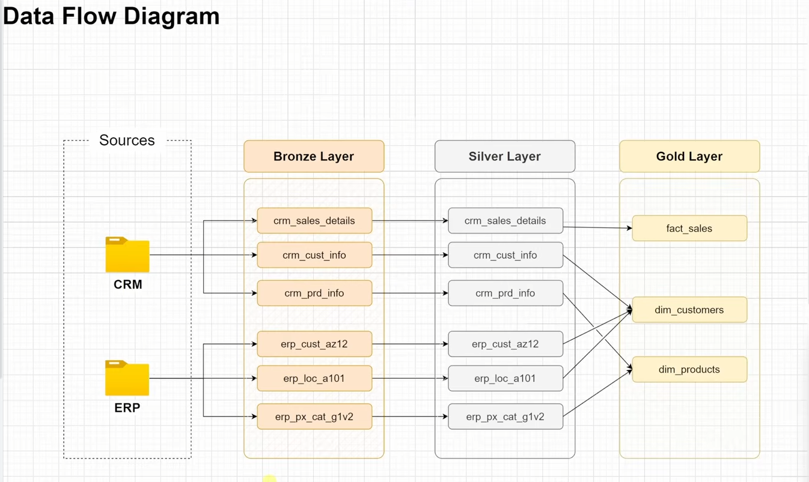

# 📦 SQL Data Warehouse Project

## 📌 Project Overview
This project demonstrates the design and implementation of a **Data Warehouse** using SQL Server.  
It follows the **ETL (Extract → Transform → Load)** methodology and organizes data into **Bronze, Silver, and Gold layers**, enabling efficient analytics and reporting.  

The project simulates integration of **CRM** and **ERP** datasets, applies cleaning and transformation logic, and builds a **Star Schema** for business analytics.

---
## Data Flow Diagram



## 🛠 Tech Stack
- **Database**: Microsoft SQL Server  
- **Language**: T-SQL  
- **Tools**: SQL Server Management Studio (SSMS)  
- **Concepts**: ETL, Star Schema, Surrogate Keys, Data Quality Checks

---

## 🗂 Project Structure
```plaintext
SQL_DataWarehouse_Project/
│
├── datasets/          # Raw CSV datasets (CRM, ERP)
├── docs/              # Project documentation & diagrams
├── scripts/           # SQL scripts for DDL, DML, quality checks
├── sets/              # Additional scripts/configurations
├── LICENSE            # Project license
└── README.md          # Project readme file
```


## 🔄 Workflow (Bronze → Silver → Gold)
1. **Bronze Layer**:  
   - Raw staging tables created for CRM and ERP data.  
   - No transformations applied, preserves original data.

2. **Silver Layer**:  
   - Data cleansing and standardization.  
   - Removal of duplicates and null records.  
   - Basic transformations applied.

3. **Gold Layer**:  
   - Final star schema with fact and dimension tables.  
   - Surrogate keys implemented.  
   - Data quality checks before reporting.

---

## 📝 How to Run the Project
1. Clone this repository:
   ```bash
   git clone https://github.com/Akshay7368/SQL_DataWarehouse_Project.git
   ```
2. Open **SQL Server Management Studio (SSMS)**.  
3. Execute scripts from `/scripts` folder in this order:
   - `ddl_commands.sql` → Creates Bronze, Silver, Gold tables.
   - `etl_scripts.sql` → Loads and transforms data.
   - `quality_check_gold.sql` → Runs final data quality checks.
4. Query the Gold Layer tables for analytics.

---

## 📌 Example Queries

**1. Total Sales by Product Category**
```sql
SELECT p.product_category, SUM(f.sales_amount) AS total_sales
FROM gold.sales_fact f
JOIN gold.dim_product p
  ON f.product_key = p.product_key
GROUP BY p.product_category
ORDER BY total_sales DESC;
```

**2. Monthly Customer Acquisition Trend**
```sql
SELECT FORMAT(c.customer_create_date, 'yyyy-MM') AS month,
       COUNT(*) AS new_customers
FROM gold.dim_customer c
GROUP BY FORMAT(c.customer_create_date, 'yyyy-MM')
ORDER BY month;
```

---

## 🚀 Future Improvements
- Automate ETL pipeline with SSIS or Azure Data Factory.  
- Add incremental data load functionality.  
- Integrate visualization dashboard (Power BI).  

---

## 👨‍💻 Author
**Akshay Kumar S**  
*Data Analyst Enthusiast*  

📌 [GitHub Profile](https://github.com/Akshay7368)  
📌 [LinkedIn Profile](https://www.linkedin.com/in/akshay-kumar-212002ak)  

---
